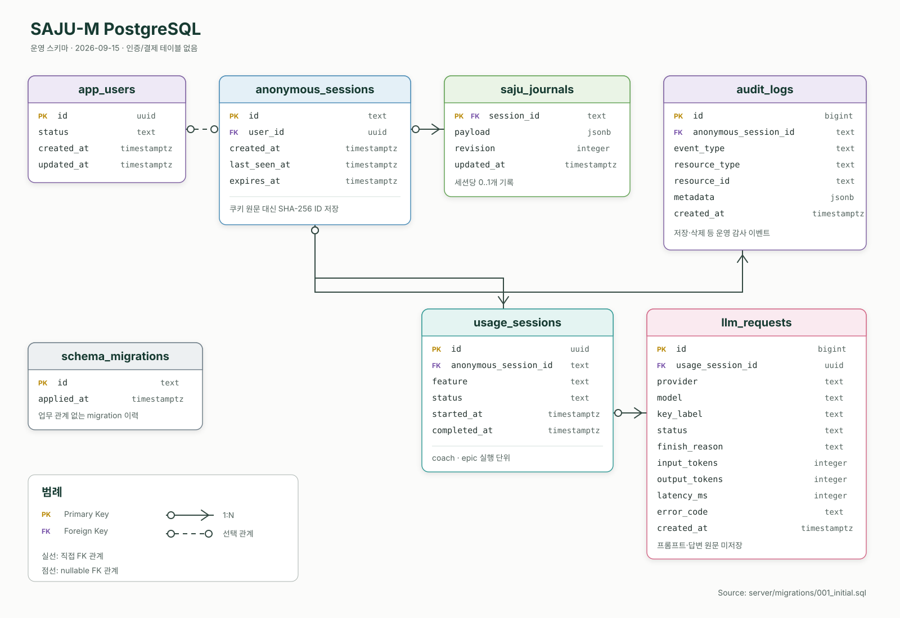
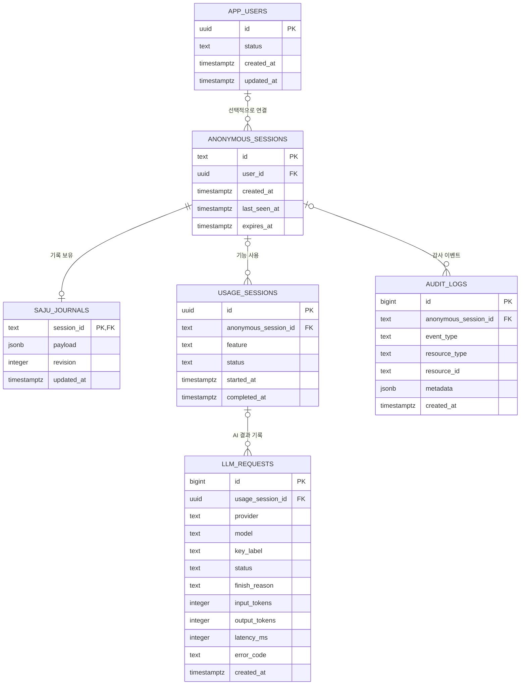

# 데이터베이스 구조

운영 데이터베이스는 PostgreSQL 하나다. 스키마 원본은 `server/migrations/*.sql`이며, 아래 문서는 읽기용 설명이다. 스키마를 바꿀 때는 기존 migration을 수정하지 말고 다음 번호의 migration을 추가한다.

## ERD

원본 크기로 보려면 [database-erd.svg](database-erd.svg)를 연다. 아래 Mermaid는 텍스트로 검색하고 변경 내역을 비교하기 위한 동일 구조 표현이다.

`schema_migrations`는 업무 ERD 밖의 운영 테이블이다. `id`와 `applied_at`으로 어떤 migration이 적용됐는지 보관한다.

## 관계 요약

| 부모 | 자식 | 관계 | 삭제 정책 |
|---|---|---|---|
| `app_users` | `anonymous_sessions` | 사용자 0..1 : 세션 N | 사용자 삭제 시 `user_id = NULL` |
| `anonymous_sessions` | `saju_journals` | 세션 1 : 기록 0..1 | 세션 삭제 시 기록 삭제 |
| `anonymous_sessions` | `usage_sessions` | 세션 0..1 : 사용 N | 세션 삭제 시 참조만 NULL |
| `usage_sessions` | `llm_requests` | 사용 0..1 : 결과 N | 사용 삭제 시 참조만 NULL |
| `anonymous_sessions` | `audit_logs` | 세션 0..1 : 로그 N | 세션 삭제 시 참조만 NULL |

현재 `app_users`는 향후 계정 연결을 위한 자리이며 회원가입·로그인 API는 구현되어 있지 않다.

## 테이블 정의

### `app_users`

| 컬럼 | 타입 | 키/NULL | 기본값 | 설명 |
|---|---|---|---|---|
| `id` | uuid | PK, NOT NULL | — | 미래 계정 ID |
| `status` | text | NOT NULL | `active` | 계정 상태 |
| `created_at` | timestamptz | NOT NULL | `now()` | 생성 시각 |
| `updated_at` | timestamptz | NOT NULL | `now()` | 변경 시각 |

### `anonymous_sessions`

| 컬럼 | 타입 | 키/NULL | 기본값 | 설명 |
|---|---|---|---|---|
| `id` | text | PK, NOT NULL | — | 쿠키를 SHA-256한 식별자 |
| `user_id` | uuid | FK, NULL | — | 향후 연결될 사용자 |
| `created_at` | timestamptz | NOT NULL | `now()` | 최초 방문 |
| `last_seen_at` | timestamptz | NOT NULL | `now()` | 최근 저장소 접근 |
| `expires_at` | timestamptz | NULL | — | 향후 만료 정책용 |

### `saju_journals`

| 컬럼 | 타입 | 키/NULL | 기본값 | 설명 |
|---|---|---|---|---|
| `session_id` | text | PK/FK, NOT NULL | — | 익명 세션 |
| `payload` | jsonb | NOT NULL | — | 프로필·선택·대화 묶음 |
| `revision` | integer | NOT NULL | `0` | 낙관적 잠금 버전 |
| `updated_at` | timestamptz | NOT NULL | `now()` | 마지막 저장 |

### `usage_sessions`

| 컬럼 | 타입 | 키/NULL | 기본값 | 설명 |
|---|---|---|---|---|
| `id` | uuid | PK, NOT NULL | — | 기능 사용 단위 |
| `anonymous_session_id` | text | FK, NULL | — | 요청 세션 |
| `feature` | text | NOT NULL | — | `coach` 또는 `epic` |
| `status` | text | NOT NULL | — | `started`, `completed`, `failed` |
| `started_at` | timestamptz | NOT NULL | `now()` | 시작 시각 |
| `completed_at` | timestamptz | NULL | — | 종료 시각 |

### `llm_requests`

| 컬럼 | 타입 | 키/NULL | 기본값 | 설명 |
|---|---|---|---|---|
| `id` | bigint identity | PK, NOT NULL | 자동 | 기록 번호 |
| `usage_session_id` | uuid | FK, NULL | — | 기능 사용 단위 |
| `provider` | text | NOT NULL | — | AI 공급자 |
| `model` | text | NULL | — | 실제 응답 모델 |
| `key_label` | text | NULL | — | 비밀 키가 아닌 운영 라벨 |
| `status` | text | NOT NULL | — | 최종 상태 |
| `finish_reason` | text | NULL | — | 공급자 종료 이유 |
| `input_tokens` | integer | NULL | — | 입력 토큰 |
| `output_tokens` | integer | NULL | — | 출력 토큰 |
| `latency_ms` | integer | NULL | — | 총 처리 시간 |
| `error_code` | text | NULL | — | 실패 분류 |
| `created_at` | timestamptz | NOT NULL | `now()` | 기록 시각 |

### `audit_logs`

| 컬럼 | 타입 | 키/NULL | 기본값 | 설명 |
|---|---|---|---|---|
| `id` | bigint identity | PK, NOT NULL | 자동 | 로그 번호 |
| `anonymous_session_id` | text | FK, NULL | — | 요청 세션 |
| `event_type` | text | NOT NULL | — | 저장·삭제 등 이벤트 |
| `resource_type` | text | NULL | — | 대상 종류 |
| `resource_id` | text | NULL | — | 대상 식별자 |
| `metadata` | jsonb | NOT NULL | `{}` | 원문을 제외한 부가 정보 |
| `created_at` | timestamptz | NOT NULL | `now()` | 발생 시각 |

## 인덱스와 운영 원칙

| 인덱스 | 목적 |
|---|---|
| `idx_usage_sessions_anonymous_session` | 세션별 최근 사용 조회 |
| `idx_llm_requests_usage_session` | 한 사용 단위의 AI 결과 조회 |
| `idx_audit_logs_session_created` | 세션별 감사 추적 |
| `idx_audit_logs_event_created` | 이벤트 유형별 장애 분석 |

- 생년월일, 대화 원문 등 사용자 내용은 `saju_journals.payload`에만 둔다.
- LLM telemetry에는 프롬프트·답변 원문을 저장하지 않는다.
- 백업, 삭제 보존기간, 계정 전환 정책은 실서비스 전에 회사 운영 정책으로 확정해야 한다.
- 개인정보 컬럼을 추가할 때는 암호화·마스킹·삭제 절차를 migration과 함께 정의한다.
